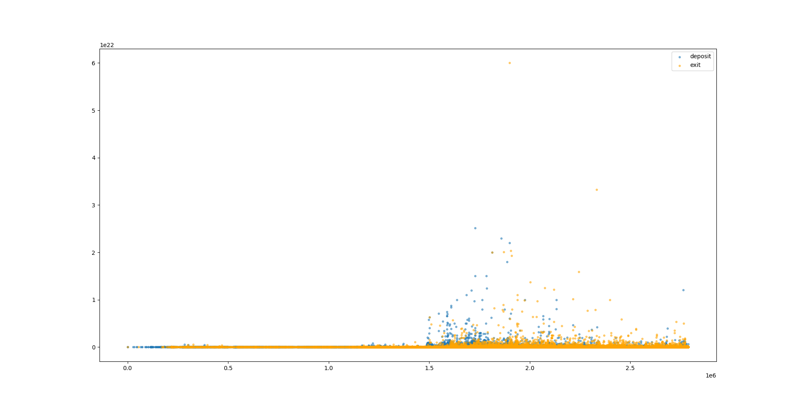
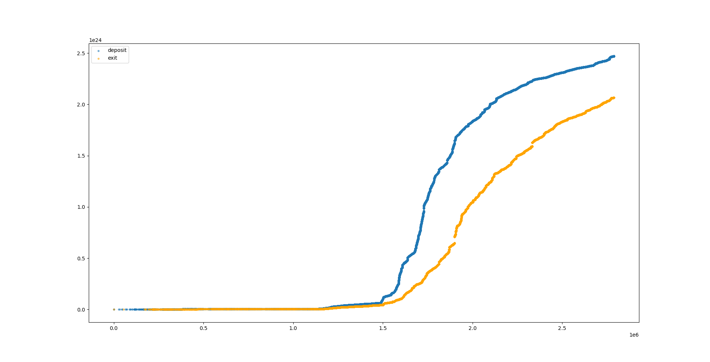
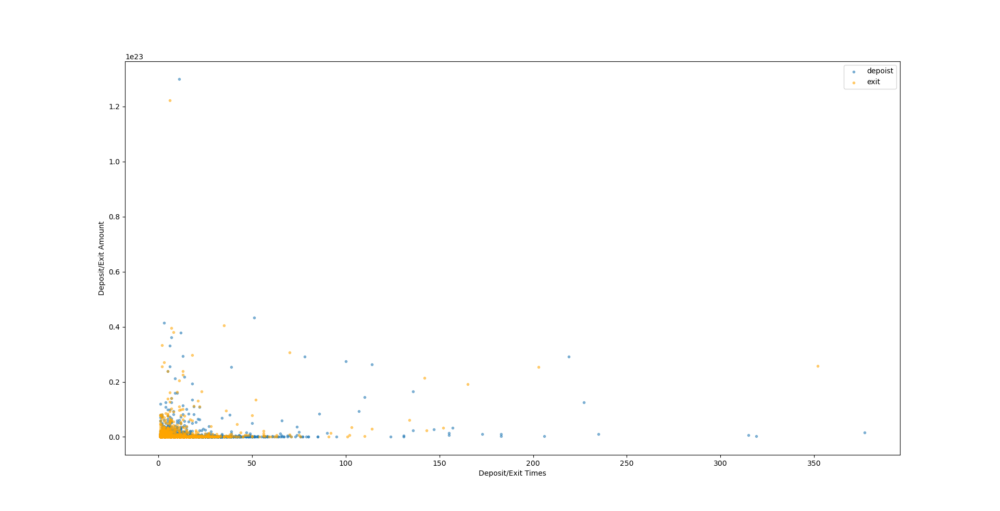
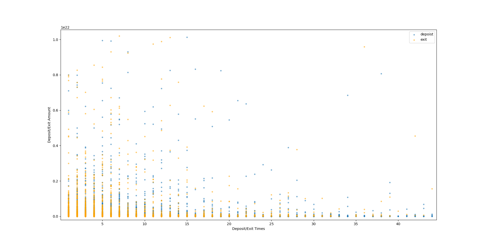

# Polygon POS Bridge Measurement

Data crawled from etherscan.io

Extracted 1119224 bridge transactions

## Ether General Information

Total ether exit: 2065007.243508653568598197 Ether

Total ether deposit: 2470262.801068893323574068 Ether

Largest ether exit in single txn: 60001.554951827596210271 Ether

Largest ether deposit in single txn: 25000.000000000000000000 Ether

Exit count: 135664 times

Deposit count: 543349 times

## Ether Deposit User Amount

| user | amount (wei) |
| :--- | :--- |
| 0x553978e22c1acd75321fa70a76226a07c20b4ca8 | 129880044153490255869369 |
| 0x6cf9aa65ebad7028536e353393630e2340ca6049 | 43347000000000000000000 |
| 0x108a8b7200d044bbbe95bef6f671baec5473e05f | 37886000000000000000000 |
| 0x58c0a5f11469ea49ad1bf0ad0d25a5cae582dd0a | 29258886390378122451915 |
| 0x276b8a4b41830343ccdd11cb3cf9c2b8bb630e5c | 29207500000000000000000 |
| 0x8f8dc9786154d159bc7e60966a8cdbf0cb9ada33 | 29185317428009203182237 |
| 0x0000f079e68bbcc79ab9600ace786b0a4db1c83c | 27424913875252260371456 |
| 0x1b6138ef934ceb32097a30d562c729d9a77bed82 | 26350020000000000000000 |
| 0x8bc110db7029197c3621bea8092ab1996d5dd7be | 25430000000000000000000 |
| 0x48d93dabf29aa5d86424a90ee60f419f1837649f | 21828349113458226832460 |

## Ether Exit User Amount

| user | a |
| :--- | :--- |
| 0x553978e22c1acd75321fa70a76226a07c20b4ca8 | 122171196071212187392396 |
| 0x671c73d9a60979b32085ec8bcf60d6957270f4f4 | 40500000000000000000000 |
| 0x84d34f4f83a87596cd3fb6887cff8f17bf5a7b83 | 39558220071668475477534 |
| 0x108a8b7200d044bbbe95bef6f671baec5473e05f | 37969949839416202618704 |
| 0x7fd18d518f70df5f1691591ab34ecbeff4ea8084 | 33291353427487208076834 |
| 0x276b8a4b41830343ccdd11cb3cf9c2b8bb630e5c | 30713637808795446545654 |
| 0x58c0a5f11469ea49ad1bf0ad0d25a5cae582dd0a | 29634769917771009349793 |
| 0xb78e90e2ec737a2c0a24d68a0e54b410fff3bd6b | 27092927044159646493941 |
| 0x3c35245937c885dda57cc588b048372e61cf2f36 | 25799901732215185489071 |
| 0xc948eb5205bde3e18cac4969d6ad3a56ba7b2347 | 25487802809722116824209 |

## Ether Deposit User Frequency

| user | times |
| :--- | :--- |
| 0x423648aacfea3e57417bcfd3ac48e1fdef4e6e8b | 377 |
| 0xe97e69e14a8731141b081738a7963c13d7349513 | 319 |
| 0xa0167224109fb20453fc025916397e4fc410010c | 315 |
| 0xe343e165769f4e51997d4ff666deae7d97ef4753 | 235 |
| 0x3c35245937c885dda57cc588b048372e61cf2f36 | 227 |
| 0x8f8dc9786154d159bc7e60966a8cdbf0cb9ada33 | 219 |
| 0xd7755f93fb694ac5c6beafdce530d03a3659930d | 206 |
| 0x7cb9fa2edbba7a8013f250b08d0c480aba176cea | 183 |
| 0x926fa53dea34bb1a2d29edaae6629bb821decb22 | 183 |
| 0x13556e5d0ce2b4ca2d42d0f64091d55c067f4910 | 173 |

## Ether Exit User Frequency

| user | times |
| :--- | :--- |
| 0x3c35245937c885dda57cc588b048372e61cf2f36 | 352 |
| 0x452905e1ea69b22ea7a2ff508ef739999bcbdbe3 | 203 |
| 0xc79df9fe252ac55af8aecc3d93d20b6a4a84527b | 165 |
| 0x6e3b517074da068d52cff10d914b502d762e5c52 | 152 |
| 0x760497bffaed0850eb7db38b5a28abc3b1c656e7 | 143 |
| 0x8f8dc9786154d159bc7e60966a8cdbf0cb9ada33 | 142 |
| 0xc8f790bf7324e2b3718e3b61a2f8964f7e4b5aa8 | 134 |
| 0x13556e5d0ce2b4ca2d42d0f64091d55c067f4910 | 114 |
| 0x979e94c3ed003e7efa9415484a80dbecb22cbd22 | 110 |
| 0xced2a0e1c3d5b96d8cbead377b897f050b980574 | 103 |

## Deposit/Exit Ether per Block

## Deposit/Exit Ether Accumulated per Block

## User Deposit/Exit Ether Amount v.s. Times

